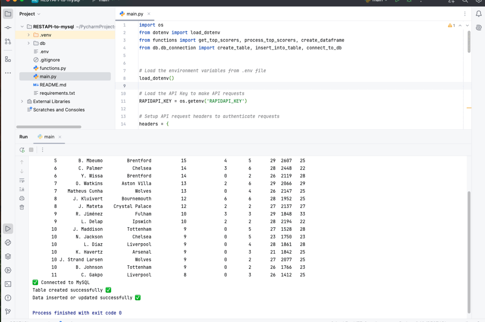

# ⚽ Football Stats ETL Pipeline (Python, API, MySQL)

This project demonstrates my ability to design and implement a complete **ETL data pipeline** using Python, external APIs, and a relational database system.

*Visual walkthrough of API to MySQL ETL pipeline*

### 🧠 What I Built
- A modular ETL pipeline that:
  - **Extracts** real-world football statistics from a public REST API (API-Football)
  - **Transforms** complex JSON responses into structured, analysis-ready data using `pandas`
  - **Loads** the cleaned data into a MySQL database with dynamic table creation and record insertion

### 🔧 Technical Highlights
- **API Integration**: Used `requests` and `dotenv` for secure and flexible API requests
- **Data Wrangling**: Parsed nested JSON and normalized it using `pandas`
- **Database Operations**: Established MySQL connection, dynamically created tables, and inserted data using `mysql-connector-python`
- **Environment Management**: Used `.env` for credentials and clean project configuration
- **Modular Design**: Separated concerns into well-organized Python modules for reusability and clarity

### 🎯 Skills Demonstrated
- End-to-end data pipeline development
- Real-time data extraction from APIs
- Data transformation and cleaning
- SQL table design and schema enforcement
- Relational database integration
- Error handling and code scalability

---

📍 This project reflects my practical knowledge in **data engineering, analytics, and automation workflows**—making it a solid foundation for real-world business intelligence or machine learning pipelines.
